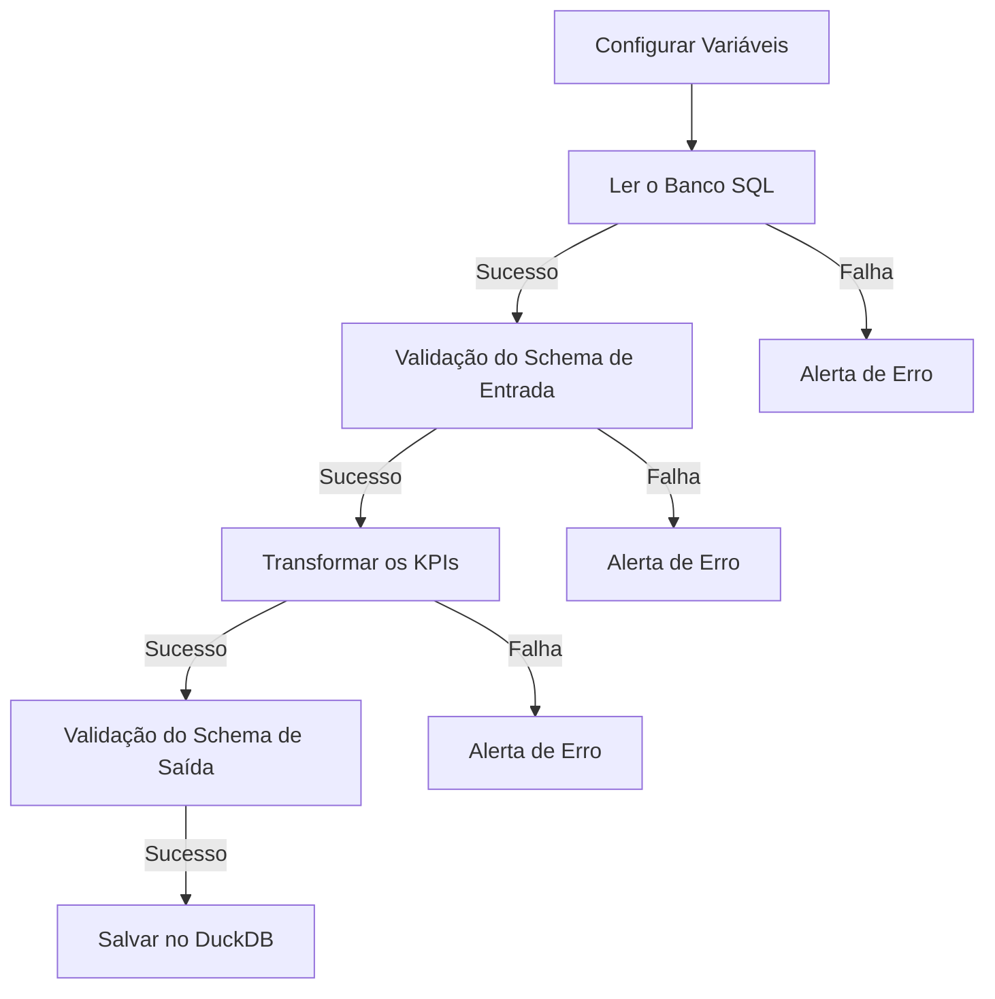

# Workshop 02 - Data Quality

Para desenovlver o desafio de negócio, vamos montar a seguinte ETL: 

```mermaid
graph TD
    A[Configurar Variáveis] --> B[Ler o Banco SQL]
    B -- Sucesso --> V[Validação do Schema de Entrada]
    B -- Falha --> X[Alerta de Erro]
    V -- Sucesso --> C[Transformar os KPIs]
    V -- Falha --> Z1[Alerta de Erro]
    C -- Sucesso --> Y[Validação do Schema de Saída]
    C -- Falha --> Z2[Alerta de Erro]
    Y -- Sucesso --> D[Salvar no DuckDB]

```
